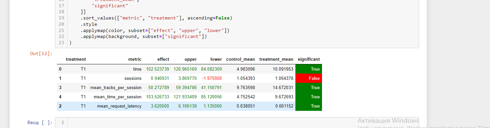

### 1. Основная идея эксперимента (1 параграф).
1. Незначительно увеличил размер обучающей выборки. просто поменяв порог по параметру для разделения на train/test  
2. Класс рекоммендера теперь кастомный: если рекомендаций не нашлось обученной моделью. то я рекомендую треки того же артиста, что пользователь  прослушал в первый раз  
3. подобрано оптимальное соотношение параметров размера эмбеддинга и числа эпох для того, чтобы в процессе обучения модель долго не останавливалась с одним val loss, прогоняя впустую обновление весов  
4. Для принятия решение по рекомендациям используется первый трек, прослушанный пользователем, а не предыдущий.  
5. Был проведен тюнинг модели: оптимизатор AdamW показал результаты лучшие, хоть и совсем незначительно (можно даже сказать, едва заметно)  
### 2. Детали: минимум того, что нужно знать, чтобы разобраться в реализации (1-2 параграфа + диаграмма).  
Реализация рекоммендера -- botify/recommenders/custom_rec.py. <br/>  
Реализация пайплайна обучения сетки -- jupyter/custom_training.ipynb.  
### 3. Результаты A/B эксперимента - в табличке как на семинарах(1 параграф + табличка).  
Значительный прирост метрики mean_tracks_per_session - 59%  
Даиграмма представлена ниже    

  

### 4. Инструкция по запуску.  
```  
cd botify  
docker-compose up -d --build  
cd ../sim  
python3 sim/run.py --episodes 1000 --config config/env.yml    
cd ../botify  
docker cp recommender-container:/app/log/ ../tmp/  
cd ../jupyter  
# Запуститите ноутбук hw1.ipynb  
```  

### 5. Нерезультативные идеи.  
В ходе попытки получить существенный прирост было проведено множество неудачных экспериментов, иногда с существенным понижением качества рекомендаций.    
Краткий список неудачных идей  
1. Построение эмбеддинга на основе ансамбля моделей (обучал несколько моделей с семинара, затем вектор эмбеддинга считал как среднее арифметическое)   
Результат: нет статистически значимого прироста    
2. Использование моделей вместо суммы по скалярному произведению (например, использовал lstm/gru или несколько линейный слоев).  
Результат: значительно падение loss на первой же эпохе, но сильная просадка по качетсву рекомендаций  
3. Неудачным был эксперимент с оператором "OneOf" вместо рекомендаций того ж артиста, что и первый трек пользователя.  
Была попытка вставить 3 способа вместе (topopop, random и artist), которые выбираются с вероятностями p1, p2, и p3.    
Результат: Как бы ни старался подобрать оптимум по этим вероятностям, свой конечный (итоговый) результат я никак не улучшил, но относительно семинарского решение дает прирост  
4. Также не подняло качество рекомендаций добавление в эмбеддинг исполнителей путем torch.cat  
Результат: loss ниже, но на качество не влияет  

